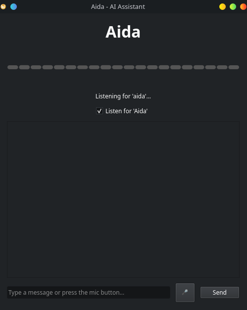
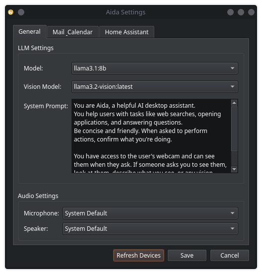
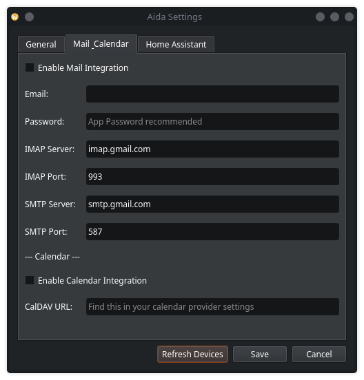
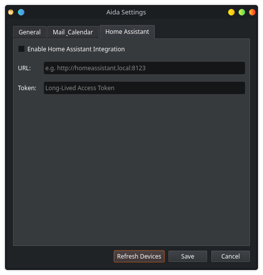

# Aida - AI Desktop Assistant for Linux



**Aida** is a versatile AI desktop assistant designed for Linux, with a focus on KDE Plasma. She provides a voice-activated interface to control your desktop, access information, and automate tasks, running primarily on local resources.

Aida is built with Python and PySide6, leveraging local AI models via Ollama and `faster-whisper` for a private and customizable experience.

## Gallery

| Main Window | Settings Dialog (General) | Settings Dialog (Mail & Calendar) | Settings Dialog (Home Assistant) |
|---|---|---|---|
|  |  |  |  |

## ✨ Features

- **Voice & Text Interface:** Interact via voice (wake word "Aida") or a modern chat window.
- **Local First AI:**
    - **LLM:** Powered by any model running in **Ollama** (e.g., Llama3, Mistral).
    - **STT:** Local, real-time speech-to-text using **`faster-whisper`**.
    - **TTS:** High-quality, natural-sounding offline text-to-speech with **PiperTTS**.
- **Web Intelligence:**
    - **Browser Automation:** Opens pages, performs searches, and fetches information using Playwright.
    - **Web Fetching:** Can read and summarize content from web pages and RSS feeds.
- **System & Desktop Integration:**
    - **Screen Awareness:** Can see and read the content of your active window using vision models.
    - **File Management:** Organize, rename, compress, and create documents in your home directory.
    - **Tray Icon:** Lives in your system tray for easy access.
- **Smart Home & Services:**
    - **Home Assistant:** Control your smart devices (lights, switches) with voice commands.
    - **Mail & Calendar (IMAP/CalDAV):** Check unread emails and view today's calendar events from providers like Gmail.
- **Task Management:**
    - **To-Do Lists:** Create, edit, and manage tasks with priorities and due dates.
    - **Home Assistant Sync:** Synchronize tasks with Home Assistant to-do lists.
    - **Reminders:** Set reminders for tasks with voice patterns recognition.
- **Kitchen & Meal Planning:**
    - **Receipt Scanning:** Scan grocery receipts with your webcam to automatically add items to inventory.
    - **Recipe Management:** Import recipes from websites, store them, and retrieve detailed instructions.
    - **Inventory Tracking:** Keep track of food items in your kitchen.
    - **Meal Planning:** Plan meals for specific days and check what's on the menu.
- **REST API & Web Interface:**
    - **FastAPI Server:** RESTful API running on port 8085 for remote access.
    - **Web Client:** Mobile-friendly web interface for chat and image analysis.
    - **Vision API:** Send images for AI analysis from mobile devices.
- **Customizable:** A comprehensive settings dialog allows you to configure models, devices, and integrations.

## 🚀 Getting Started

### Prerequisites

You'll need a working Python environment and a few system dependencies. Aida is designed for Linux and tested on KDE Plasma.

- **Python 3.11+**
- **Ollama:** A running instance of [Ollama](https://ollama.com/) with your desired models pulled (e.g., `ollama pull llama3`, `ollama pull llava`).
- **System Tools:**
    - `spectacle`: For screenshots on KDE.
    - `mpv`: For audio playback (used by Edge TTS).
    - `xdotool` (Optional): For window management features.

### Installation

1.  **Clone the repository:**
    ```bash
    git clone https://github.com/your-username/aida.git
    cd aida
    ```

2.  **Run the setup script:**
    The `run.sh` script will create a Python virtual environment, install all dependencies, and launch the application.
    ```bash
    ./run.sh
    ```
    The first time you run this, it will download necessary AI models and libraries, which may take some time.

## 🔧 Configuration

After the first launch, Aida creates a configuration file at `~/.config/aida/config.json`.

You can configure Aida through the **Settings** dialog (accessible from the tray icon). Here you can:
- Select your Ollama models.
- Choose your microphone and speakers.
- Set up **Mail**, **Calendar**, and **Home Assistant** integrations by providing credentials and URLs.
- Enable/disable the wake word listener.

**Important Notes:**
- **Gmail:** For Gmail integration, you must generate an **App Password** as Google no longer allows direct password logins for less secure apps.
- **Home Assistant:** You need to generate a **Long-Lived Access Token** from your Home Assistant profile page.
- **Kitchen Features:** The kitchen and meal planning features require a separate [Aida-Kitchen](https://github.com/your-username/aida-kitchen) server running on `http://localhost:8000`. This is optional and the assistant will work without it.

## 🗣️ Usage

### Desktop Application

- **Wake Word:** Say "Aida" to activate listening.
- **Mic Button:** Click the microphone icon in the main window or tray to toggle listening.
- **Text Input:** Type commands directly into the chat box.
- **Tasks Window:** Access from the tray icon menu to manage your to-do list.

### Web Interface & API

Aida includes a built-in REST API server that starts automatically with the application:

- **Web Client:** Navigate to `http://localhost:8085` in your browser for a mobile-friendly chat interface
- **API Documentation:** The API server runs on port 8085 with the following endpoints:
  - `POST /api/chat` - Send text messages to Aida
  - `POST /api/vision` - Send images for AI analysis
  - `GET /api/status` - Check if Aida is ready

This makes it easy to interact with Aida from mobile devices on your local network.

### Example Commands

- **Web:**
    - "Open vg.no"
    - "Search for the weather in Oslo"
    - "Fetch RSS feed from https://www.nrk.no/toppsaker.rss"
- **System:**
    - "Read this screen"
    - "Organize my Downloads folder"
    - "Save this conversation as a file called 'My Ideas'"
- **Home Assistant:**
    - "Turn on the living room light"
    - "Turn off the fan"
- **Mail & Calendar:**
    - "Check my email"
    - "What's on my calendar today?"
- **Tasks:**
    - "Add a task to buy groceries"
    - "Show my tasks"
    - "Remind me to call mom tomorrow"
- **Kitchen & Food:**
    - "Scan this receipt" (hold receipt to webcam)
    - "What's in my inventory?"
    - "Import recipe from [URL]"
    - "What's for dinner today?"
    - "Add chicken to meal plan for tomorrow"
    - "Show me the recipe for pancakes"

## 🏗️ Architecture

Aida is built with a modular architecture:

- **Core:** Assistant logic, configuration management, and audio device handling
- **AI:** LLM interaction via Ollama, with support for both chat and vision models
- **Speech:** Real-time STT with faster-whisper, TTS with PiperTTS, and wake word detection
- **Vision:** Screen capture and webcam integration for visual context
- **Actions:** Modular action system for browser automation, file management, mail, calendar, Home Assistant, and kitchen integration
- **Tasks:** Full task management system with SQLite storage and Home Assistant synchronization
- **Memory:** Conversation history, facts storage, and context management with embeddings
- **API:** FastAPI-based REST API for remote access and web client
- **UI:** PySide6-based GUI with main window, system tray, settings dialog, and tasks window

## 🤝 Contributing

Contributions are welcome! If you'd like to add new features or fix bugs, please feel free to fork the repository and submit a pull request.

## 📄 License

This project is licensed under the MIT License - see the `LICENSE` file for details.
